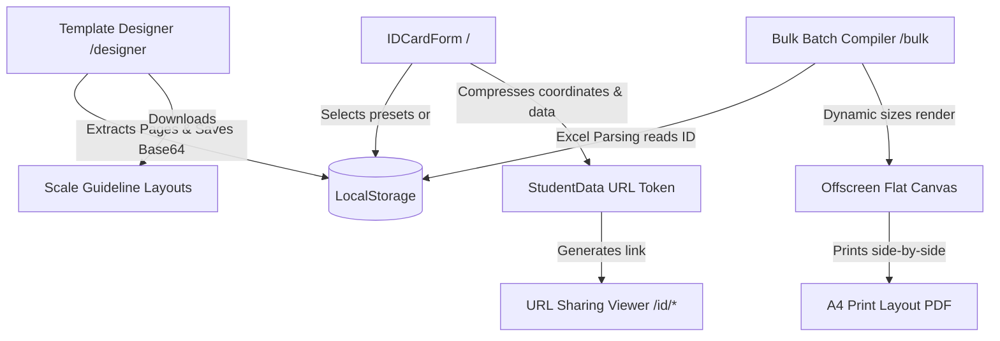

# 🎨 ID Card Studio (`idcardgen`)

[](https://nextjs.org)
[](https://reactjs.org)
[](https://tailwindcss.com)
[](#)
[](https://github.com/hxrshrathore/idcardgen/network)
[](https://github.com/hxrshrathore/idcardgen/stargazers)

An offline-first, client-side institutional ID Card Studio built on **Next.js 16**, **React 19**, and **Tailwind CSS 4**. This platform functions **100% serverless**, utilizing high-performance image compression and **LZString URL state serialization** to encode entire ID card layouts, credentials, and assets directly inside shareable URL tokens (<2KB) without a backend database.

## 🔗 Live Repository
* **GitHub Repository**: [github.com/hxrshrathore/idcardgen](https://github.com/hxrshrathore/idcardgen)
* **Developer**: [@hxrshrathore](https://github.com/hxrshrathore)

---

## 🎨 Architectural Overview



---

## 🚀 Key Modules & Capabilities

### 1. 🎛️ Single Generation Funnel (Home `/`)
* **Dynamic 3D Real-time Preview**: Features an interactive 3D card deck preview displaying genuine physics-based mouse tilt effects and click-to-flip cards on their Z-axis.
* **School Logo Integration**: Accommodates custom institution logo uploads alongside standard school names. When a logo is present, standard headers render a high-fidelity rounded logo container; otherwise, they fall back to styled mesh initials (e.g. `DPS`).
* **Signature Canvas & Asset Pack**: Includes an interactive touch/mouse canvas to capture digital signatures instantly, combined with an optimized preloaded avatars gallery.
* **Compact URL Packing**: Converts photos, signatures, and logos into scaled WebP data structures, running them through compression to fit inside a single browser address bar link.

### 2. 🎨 Visual Template Designer (`/designer`)
* **Background Extraction**: Integrates client-side **PDF.js** rendering. Users can upload standard portrait or landscape high-res multi-page PDF/PNG guidelines, extracting Front and Back backgrounds dynamically.
* **Absolute Grid Canvas**: Features drag-and-drop and real-time bounding box resize handles mapping elements using relative percentage vectors (`x`, `y`, `w`, `h` from `0` to `100`).
* **Keyboard Nudge Mechanics**: Precision adjusting lets users select fields and nudge them in `1%` increments using keyboard arrow keys.
* **Custom Typography Panel**: Features sliders for font sizing, dynamic weight toggles (Bold/Italic), text alignment grids (`Left`/`Center`/`Right`), text color selectors, and custom coordinates mapping.

### 3. 📊 Multi-Page Bulk Batch Compiler (`/bulk`)
* **Auto-Orientation Selector**: Reads template schemas dynamically; custom spreadsheet templates starting with `custom-` automatically determine whether cards compile in landscape or portrait.
* **ZIP Archive Resolver**: Parses columns in standard spreadsheets matching student images and institution logos, resolving files locally from uploaded photos ZIP directories completely in-browser.
* **A4 Grid Auto-Centerer**: Automatically divides cards (up to 10 per page) into 2-column print layouts. The mathematical centering matches:
  $$\text{Margin Offset} = \frac{\text{A4 Width (210mm)} - (2 \times \text{Card Width} + \text{Gap (15mm)})}{2}$$
  This provides pixel-perfect cut lines and center folds for double-sided print sheets.
* **Self-Contained Sample Formats**: Users can download a pre-packaged ZIP containing standard columns (Name, ID, Class, School, Phone, Blood Group, Photo Filename, School Logo, Template) with sample mock images ready to verify layout compilation.

---

## 💾 Core Serialization Pipeline

To bypass backend databases and protect user privacy, card data is packed into a compact URL token:

```typescript
// Compact Payload Structure (~150 bytes excluding custom base64 images)
export interface CompactPayload {
  n: string;    // name
  i: string;    // idNumber
  s: string;    // school
  r?: string;   // role
  g?: string;   // grade
  e?: string;   // email
  p?: string;   // phone
  b?: string;   // bloodGroup
  d?: string;   // issueDate
  x?: string;   // expiryDate
  t: string;    // template ID (e.g., cbse-portrait)
  c?: string;   // custom theme hexadecimal
  a?: string;   // avatar Base64 WebP representation
  gS?: string;  // digital signature Base64
  sl?: string;  // school logo Base64
  o?: 'portrait' | 'landscape'; // card orientation
  cc?: string;  // compressed inline template coordinates config
}
```

---

## 🛠️ Technology Stack

* **Framework**: Next.js 16 (App Router)
* **Core Engine**: React 19 (Hooks, Context, Client/Server routing splits)
* **Styling**: Tailwind CSS v4 & Vanilla CSS variables
* **Icons**: `lucide-react`
* **Layout Parsing**: `xlsx` (SheetJS)
* **Compression**: `lz-string` (Lempel-Ziv-Welch URL safe tokens)
* **File Operations**: `jszip` & `file-saver` (batch package compilation)
* **QR Codes**: `qrcode`
* **Real Barcode Rendering**: Pure vector SVG renderer generating high-fidelity **Code 128** linear profiles
* **Image Capture**: `html2canvas-pro` (v2.0.2 for clean, hardware-accelerated offscreen flat face generation)
* **PDF Compilation**: `jspdf` (for accurate high-DPI millimeter vector offsets)

---

## 📂 Directory Layout

```
idcardgen/
├── public/                 # Static assets & sample templates
├── src/
│   ├── app/                # Next.js App Router Page Tree
│   │   ├── bulk/           # /bulk - Batch sheet generator layout
│   │   ├── designer/       # /designer - Drag-and-drop template designer workspace
│   │   ├── id/             # /id/[token] - Single-card digital verification link
│   │   ├── layout.tsx      # Core viewport wrappers & Google Fonts injection
│   │   └── page.tsx        # Homepage - Single generator funnel
│   ├── components/         # High-Performance UI Components
│   │   ├── IDCardForm.tsx  # Dynamic Details Form (avtar, sig-pad, logo upload)
│   │   └── IDCardPreview.tsx # 3D Deck, Emblems, and Custom ID Card Face
│   └── utils/              # Utility Functions
│       ├── avatars.ts      # Stylized preloaded mock avatar profiles
│       └── compressor.ts   # LZString encoders/decoders & image resizing bounds
├── package.json            # Scripts & Dependency mapping
└── tsconfig.json           # Strict type-checking boundaries
```

---

## ⚡ Quickstart & Development

### 1. Prerequisite Setup
Ensure you have [Node.js](https://nodejs.org) (v18+ recommended) installed on your local machine.

### 2. Installation
Clone the repository and install dependencies:
```bash
git clone https://github.com/hxrshrathore/idcardgen.git
cd idcardgen
npm install
```

### 3. Start Development Server
Launch the Next.js Turbopack development hot-reloader:
```bash
npm run dev
```
Open [http://localhost:3000](http://localhost:3000) inside your web browser.

### 4. Build Production Bundle
To build the static application and perform strict TypeScript compilation audits:
```bash
npm run build
```

---

## 🛡️ License

This project is licensed under the MIT License. See the [LICENSE](LICENSE) file for details.
